# Informações do Projeto
`TÍTULO DO PROJETO`  

......  COLOQUE AQUI O SEU TEXTO ......

`CURSO` 

......  COLOQUE AQUI O SEU TEXTO ......

## Participantes

......  COLOQUE AQUI O SEU TEXTO ......

> Inclua a lista dos membros da equipe com seus nomes completos.
>
> Os membros do grupo são: 
> - João Madeira Carneiro Braga de Freitas
> - João Lucas Azeredo Coutinho Curi
> - Arthur Candian
> - Guilherme de Brites

# Estrutura do Documento

- [Informações do Projeto](#informações-do-projeto)
  - [Participantes](#participantes)
- [Estrutura do Documento](#estrutura-do-documento)
- [Introdução](#introdução)
  - [Problema](#problema)
  - [Objetivos](#objetivos)
  - [Justificativa](#justificativa)
  - [Público-Alvo](#público-alvo)
- [Especificações do Projeto](#especificações-do-projeto)
  - [Personas, Empatia e Proposta de Valor](#personas-empatia-e-proposta-de-valor)
  - [Histórias de Usuários](#histórias-de-usuários)
  - [Requisitos](#requisitos)
    - [Requisitos Funcionais](#requisitos-funcionais)
    - [Requisitos não Funcionais](#requisitos-não-funcionais)
  - [Restrições](#restrições)
- [Projeto de Interface](#projeto-de-interface)
  - [User Flow](#user-flow)
  - [Wireframes](#wireframes)
- [Metodologia](#metodologia)
  - [Divisão de Papéis](#divisão-de-papéis)
  - [Ferramentas](#ferramentas)
  - [Controle de Versão](#controle-de-versão)
- [*############## SPRINT 1 ACABA AQUI #############*](#-sprint-1-acaba-aqui-)
- [Projeto da Solução](#projeto-da-solução)
  - [Tecnologias Utilizadas](#tecnologias-utilizadas)
  - [Arquitetura da solução](#arquitetura-da-solução)
- [Avaliação da Aplicação](#avaliação-da-aplicação)
  - [Plano de Testes](#plano-de-testes)
  - [Ferramentas de Testes (Opcional)](#ferramentas-de-testes-opcional)
  - [Registros de Testes](#registros-de-testes)
- [Referências](#referências)

# 1 Introdução:

A organização financeira é um objetivo de muitos indivíduos na sociedade brasileira, entretanto tal organização, muitas vezes, não é alcançada por conta da falta de meios e de conhecimentos em educação financeira. Nesse sentido, a proposta deste trabalho é apresentar um projeto de desenvolvimento de um aplicativo de controladoria e organização financeira, que tem como objetivo auxiliar os brasileiros na gestão de suas finanças pessoais.

O projeto, que será desenvolvido pelos integrantes do grupo, terá diversas funcionalidades que permitirão aos usuários registrar suas receitas e despesas, fazer o acompanhamento do orçamento, estabelecer metas financeiras e integrar os orçamentos de diferentes usuários, para casos de família ou de amigos.

Ao longo deste relatório, serão apresentados os pontos principais pelos quais ocorreram o processo de especificação e de criatividade do projeto e os planejamentos em relação a metodologia e a interface do site. 

## 1.1 Problema:
Conforme exposto, o problema que se busca resolver com este projeto é a dificuldade para a organização financeira individual ou conjunta de um grupo de indivíduos, devida a falta de ferramentas simplificadas e acessíveis.  

Possibilitar aos indivíduos uma ferramenta auxiliar para gerirem as suas finanças e fazer a controladoria de seus gastos de forma fácil e integrada.

## 1.2 Objetivos
O objetivo geral deste trabalho é a criação de uma plataforma que apresenta ferramentas que auxiliem os usuários a gerirem suas finanças e fazerem a controladoria de seus gastos de forma fácil e integrada.
Como objetivos específicos, podemos ressaltar:
    
    -Rastreamento de despesas para permitir que os usuários acompanhem suas despesas diárias e as categorizem por tipo, como alimentação, transporte, lazer, entre outros.
    
    -Organização Financeira.
    
    -Alertas de gastos, enviar notificações para usuários quando eles estiverem se aproximando ou ultrapassando seus limites de gastos, ou quando uma conta estiver prestes a vencer.
    
    -Segurança e privacidade, garantir que o aplicativo seja seguro e proteja a privacidade dos usuários, usando criptografia para proteger dados pessoais e financeiros.

## 1.3 Justificativa
A organização financeira é imprescindível para os indivíduos que desejam ter qualidade de vida e/ou sucesso financeiro. De acordo com o  "The Benefits of Creating a Budget", artigo do site Forbes, a organização financeira fazendo o uso de um orçamento é necessária para alcançar e traçar as suas metas financeiras	
Paralelamente, há uma carência de plataformas simplificadas e acessíveis de registro integrado de contas e gastos, e que permitam aos usuários gerenciar e estabelecer limites de gastos para diferentes categorias, como transporte, saúde e alimentação. 

## 1.4 Público-Alvo
Nossa plataforma visa atender toda e qualquer pessoa com interesse em obter uma organização financeira, sejam indivíduos recém inseridos no mercado, ou qualquer outra pessoa que queira gerir suas finanças.

Contudo, estabeleceu-se como público-alvo os homens e as mulheres entre 25 e 48 anos que, em geral, são indivíduos que trabalham de forma remunerada e buscam obter uma maior estabilidade financeira e por muitas vezes buscam fazer uma gestão de gastos e controle de suas finanças, procurando economizar e/ou fazer controladoria de gastos.

 
# 2 Especificações do Projeto
A definição exata do problema e os pontos mais relevantes a serem tratados neste projeto foi consolidada com a participação dos usuários em um trabalho de imersão feito pelos membros da equipe a partir da observação dos usuários em seu local natural e por meio de entrevistas. Os detalhes levantados nesse processo foram consolidados na forma de personas e histórias de usuários.

## 2.1 Personas, Empatia e Proposta de Valor

As personas levantadas durante o processo de entendimento do problema são apresentadas na Figuras que se seguem.

> 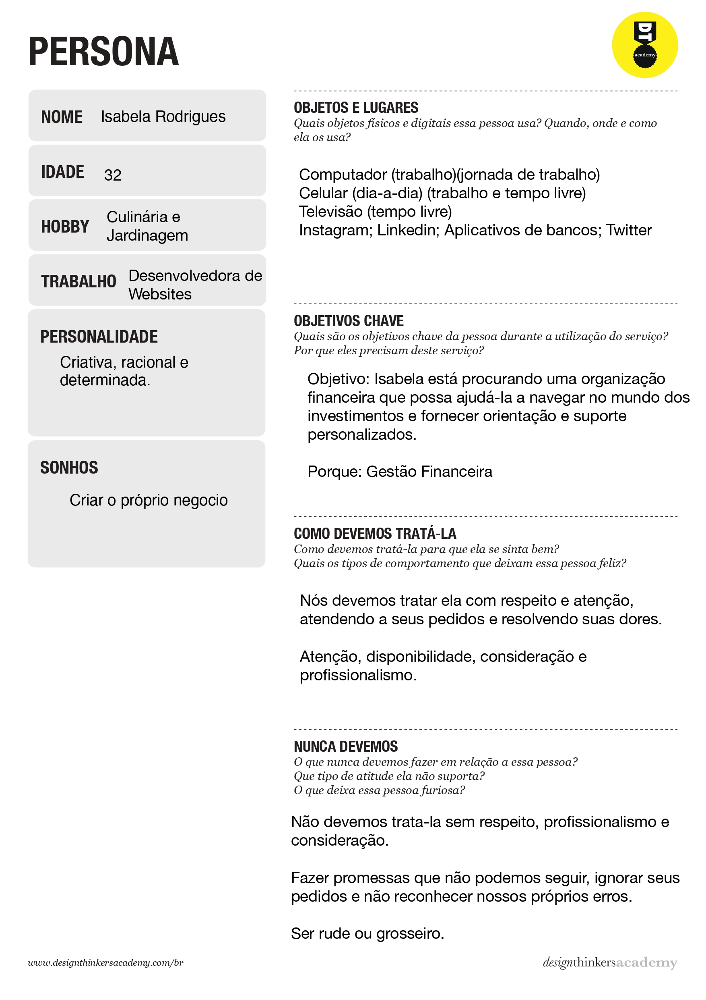
> 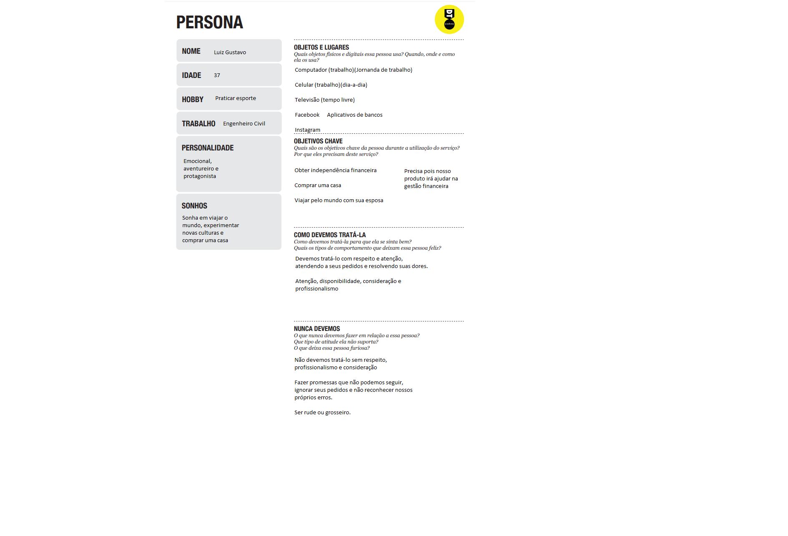
> 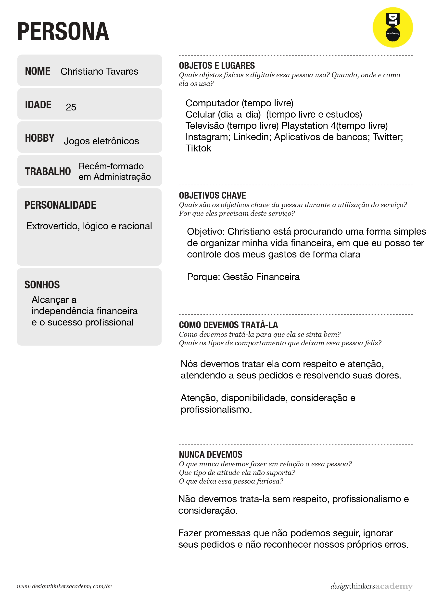
> 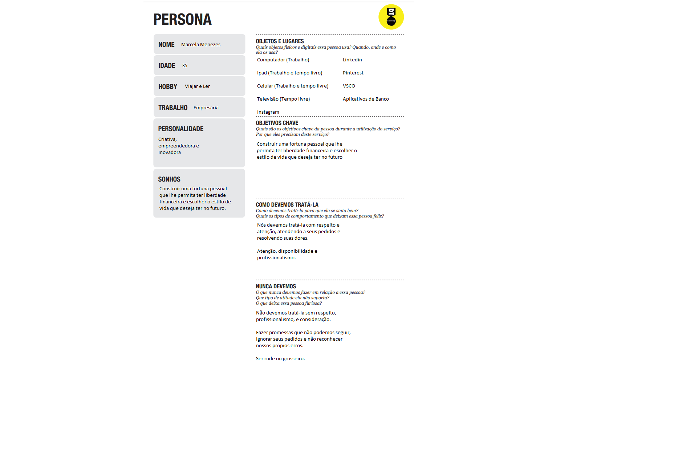

> *Proposta de Valor*
> 
> 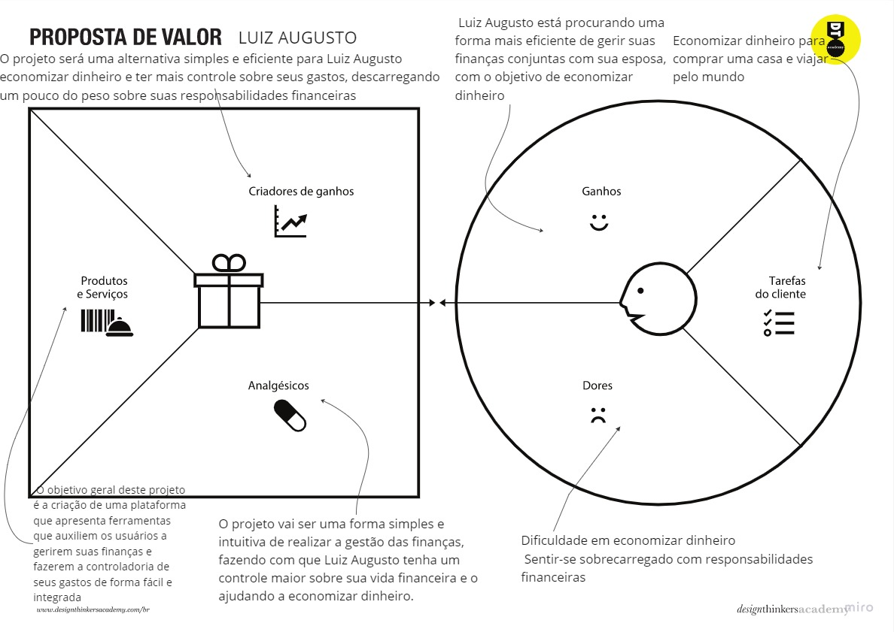
> 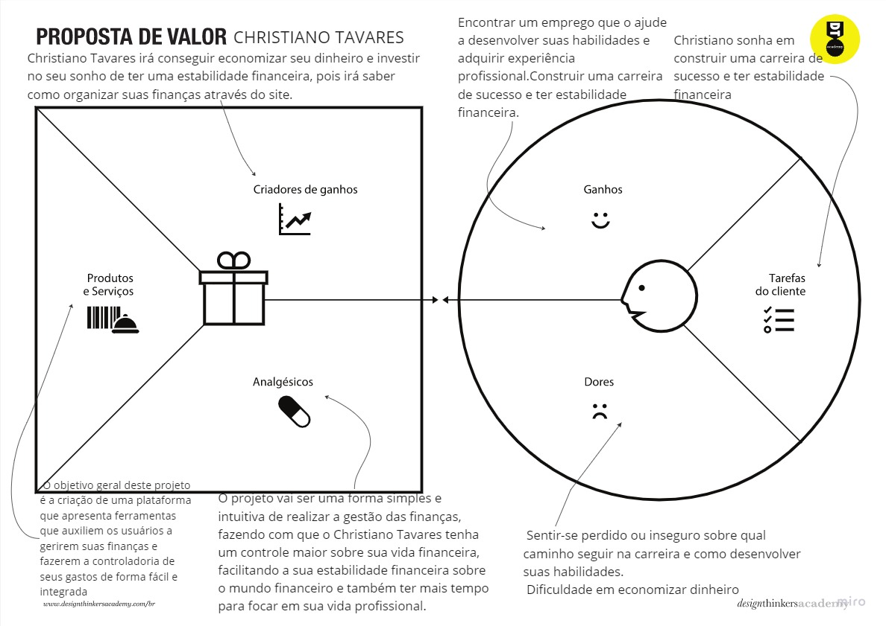
> 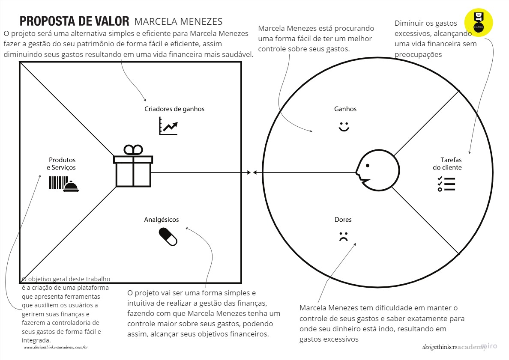

## 2.2 Histórias de Usuários

Com base na análise das personas forma identificadas as seguintes histórias de usuários:

|EU COMO... `PERSONA`| QUERO/PRECISO ... `FUNCIONALIDADE` |PARA ... `MOTIVO/VALOR`                 |
|--------------------|------------------------------------|----------------------------------------|
|Isabela Rodrigues   |uma organização financeira que possa|       abrir seu próprio negócio        |
|                    |ajudá-la a navegar no mundo dos     |                                        |
|                    |investimentos e fornecer orientação |                                        |
|                    |e suporte personalizados            |                                        |
|--------------------|------------------------------------|----------------------------------------|
|Luiz Gustavo        |uma forma mais eficiente de gerir   |  Comprar uma casa e viajar pelo mundo  |
|                    |suas finanças conjuntas com sua     |                                        |
|                    |esposa, com o objetivo de economizar|                                        |
|                    |dinheiro                            |                                        |
|--------------------|------------------------------------|----------------------------------------|
|Christiano Tavares  |uma forma simples de organizar minha|    Economizar dinheiro e alcançar a    |
|                    |vida financeira, em que eu posso ter|   estabilidade financeira              |
|                    |controle dos meus gastos de forma   |                                        |
|                    |clara                               |                                        |
|--------------------|------------------------------------|----------------------------------------|
|Marcela Menezes     |uma forma de ter um melhor controle |    Diminuir os gastos excessivos,      |
|                    |sobre seus gastos                   |alcançando uma vida financeira sem      |
|                    |                                    |preocupações                            |
|                    |                                    |                                        |
|--------------------|------------------------------------|----------------------------------------|

> projeto de sua solução. As Histórias de Usuário consistem em uma
> ferramenta poderosa para a compreensão e elicitação dos requisitos
> funcionais e não funcionais da sua aplicação. Se possível, agrupe as
> histórias de usuário por contexto, para facilitar consultas
> recorrentes à essa parte do documento.
>
> *Links Úteis*:
> - [Histórias de usuários com exemplos e template](https://www.atlassian.com/br/agile/project-management/user-stories)
> - [Como escrever boas histórias de usuário (User Stories)](https://medium.com/vertice/como-escrever-boas-users-stories-hist%C3%B3rias-de-usu%C3%A1rios-b29c75043fac)

## 2.3 Requisitos
O escopo funcional do projeto é definido por meio dos requisitos funcionais que descrevem as possibilidades interação dos usuários, bem como os requisitos não funcionais que descrevem os aspectos que o sistema deverá apresentar de maneira geral. Estes requisitos são apresentados a seguir.

### 2.3.1 Requisitos Funcionais
A tabela a seguir apresenta os requisitos do projeto, identificando a prioridade em que os mesmos devem ser entregues.

|ID    | Descrição do Requisito  | Prioridade    |      |
|------|-----------------------------------------|------|
|RF-001|O site deve permitir que os usuários     |      |
|      |registrem todas as suas receitas e       |ALTA  |
|      |despesas de forma fácil e organizada.    |      |
|      |                                         |      |
|------|-----------------------------------------|------| 
|RF-002|O site deve permitir que os usuários.    |      |
|      |criem e gerenciem seus orçamentos mensais|ALTA  |
|      |e anuais.                                |      |
|      |                                         |      |
|------|-----------------------------------------|------|
|RF-003|O site deve enviar alertas aos usuários  |      |
|      |quando estiverem próximos de atingir seus|ALTA  |
|      |limites de gastos.                       |      |
|      |                                         |      |
|------|-----------------------------------------|------|
|RF-004|O site deve permitir que os usuários     |      |
|      |classifiquem suas transações em          |ALTA  |
|      |categorias, como alimentação, transporte,|      |
|      | moradia, entre outras.                  |      |
|------|-----------------------------------------|------|
|RF-005|O site deve apresentar uma previsão do   |      |
|      |fluxo de caixa futuro, com base nas      |MEDIA |
|      |informações inseridas pelo usuário.      |      |
|      |                                         |      |
|------|-----------------------------------------|------|
|RF-006|O site deve permitir que os usuários     |      |
|      |gerem relatórios financeiros, como       |BAIXA |
|      |balanços e demonstrações de resultados.  |      |
|      |                                         |      |
|------|-----------------------------------------|------|
|RF-007|Permitir a integração da portabilidade de|      |
|      |dois ou mais usuários na plataforma,     |MEDIA |
|      |permitindo a organização financeira      |      |
|      |conjunta de casais e/ou famílias.        |      |
|------|-----------------------------------------|------|
|RF-008|O site deve enviar notificações aos      |      |
|      |usuários quando suas contas estiverem    |MEDIA |
|      |próximas do vencimento, para que não     |      |
|      |sejam esquecidas ou pagas com atraso.    |      |
|------|-----------------------------------------|------|
|RF-009|O site deve permitir a integração com    |      |
|      |ferramentas como  calendários e listas de|BAIXA |
|      |tarefas, para que os usuários possam     |      |
|      |gerenciar suas finanças de forma mais    |      |
|------|-----------------------------------------|------|

### 2.3.2 Requisitos não Funcionais
A tabela a seguir apresenta os requisitos não funcionais que o projeto deverá atender.
|ID    | Descrição do Requisito                                                 | Prioridade |
|------|------------------------------------------------------------------------|------------|
|------|------------------------------------------------------------------------|------------|
|RF-001| O site deve ser publicado em um ambiente acessível                     |            |
|      |publicamente na Internet (Repl.it, GitHub Pages, Heroku);               |    ALTA    |
|------|------------------------------------------------------------------------|            |
|RF-002| O site deverá ser responsivo permitindo                                |            |
|      | a visualização em um celular de forma adequada                         |    ALTA    |
|------|------------------------------------------------------------------------|------------|
|RF-003| O site deve ter bom nível de contraste                                 |            |
|      | entre os elementos da tela em conformidade                             |    MÉDIA   |
|------|------------------------------------------------------------------------|------------|
|RF-004| O site deve ser compatível com os principais                           |            |
|      | navegadores do mercado (Google Chrome, Firefox, Microsoft Edge)        |    ALTA    |
|------|------------------------------------------------------------------------|------------|
|RF-005| O site deve ser seguro e garantir a privacidade dos dados dos usuários |            | 
|      | por meio de criptografia, autenticação de usuários, backup de dados e  |            |
|      | outras medidas de segurança.                                           |    ALTA    |
|------|------------------------------------------------------------------------|------------|
|RF-006| O site deve estar disponível 24 horas por dia, 7 dias por semana,      |            |
|      | com tempo de inatividade mínimo ou nulo                                |    ALTA    |
|------|------------------------------------------------------------------------|------------|
|RF-007| O site deve ser fácil de usar e navegar, com uma interface intuitiva e |            |
|      | bem projetada, e com suporte para vários dispositivos,                 |            |
|      | como computadores e dispositivos móveis.                               |    ALTA    |
|------|------------------------------------------------------------------------|------------|

## 2.4 Restrições

As questões que limitam a execução desse projeto e que se configuram como obrigações claras para o desenvolvimento do projeto em questão são apresentadas na tabela a seguir.

|ID| Restrição                                                                |
|--|--------------------------------------------------------------------------|
|01| O projeto deverá ser entregue até o final do semestre                    |
|02| O aplicativo deve se restringir às tecnologias básicas da Web no Frontend|
|  | e Backend                                                                |
|03| A equipe não pode subcontratar o desenvolvimento do trabalho             |
|--|--------------------------------------------------------------------------|

# 3 Projeto de Interface

De acordo com os objetivos traçados nas etapas anteriores, a preocupação em torno da montagem da interface do sistema é fazer uma plataforma que tenha uma interface simples e de fácil utilização.

## 3.1 User Flow
O diagrama apresentado na Figura “Fluxo de telas do usuário” mostra o fluxo de interação do usuário pelas telas do sistema. Cada uma das telas deste fluxo é detalhada na seção de Wireframes que se segue. Para visualizar o wireframe interativo, acesse o ambiente MarvelApp do projeto.
> 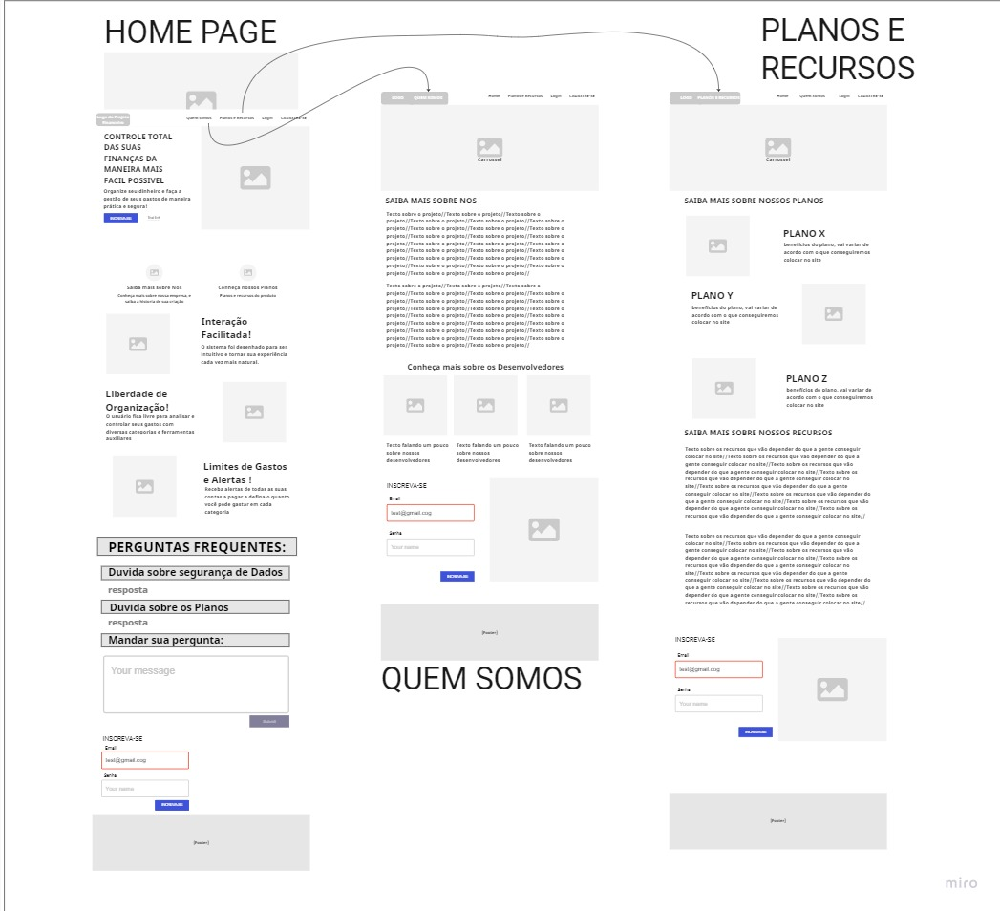

## 3.2 Wireframes
Conforme fluxo de telas do projeto, apresentado no item anterior, as telas do sistema são apresentadas em detalhes nos itens que se seguem. As telas do sistema apresentam uma estrutura que é apresentada na Figura “Fluxo de telas do usuário” . Nesta estrutura, existem 3 grandes interfaces, descritos a seguir. São eles:
  -Home Page - Página na qual é a inicial do site, contendo diversas imagens chamativas e informações do produto para conquistar o cliente ;
  -Quem Somos - apresenta a história criativa e de desenvolvimento da nossa plataforma e fala sobre os integrantes do projeto;
  -Planos e Recursos - apresenta os planos da nossa plataforma para o usuário e detalha sobre os recursos do nosso projeto.

## 3.3 Tela - Home-Page
A tela de home-page é a página inicial do site, contendo diversas imagens chamativas e informações do produto para conquistar o cliente. O bloco superior da tela tem os principais acessos às outras telas do site:
  -Componente de CADASTRE-SE leva o usuário ao campo de increva-se;
  -Componente de LOGIN abre a caixa para login ;
  -Componente de PERGUNTAS FREQUENTES mostra ao usuário perguntas recorrentes dos internautas;
  -Componente de ENVIAR SUA PERGUNTA permite ao usuário enviar perguntas para os desenvolvedores;
  -Componente de INSCREVA-SE permite ao usuário realizar seu cadastro no site;
  -Componentes de QUEM SOMOS e PLANOS E RECURSOS dão acesso às páginas de cada uma das seções disponibilizadas abaixo, respectivamente;

> 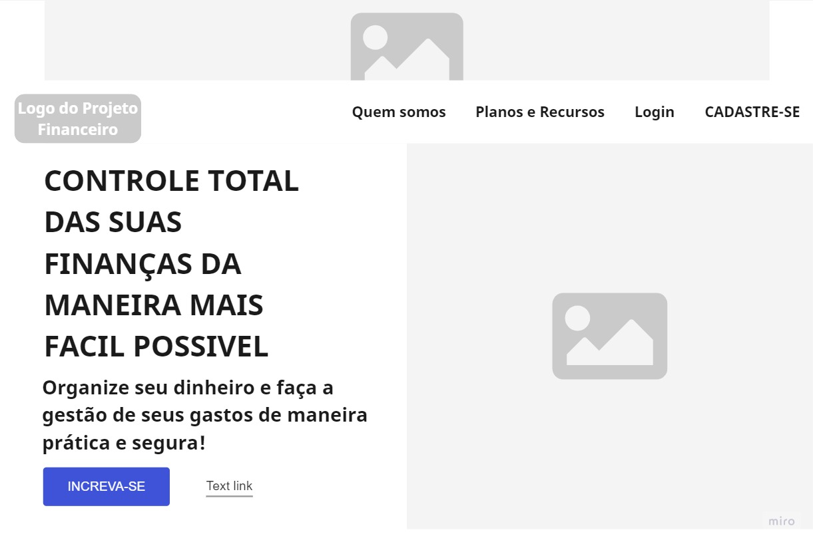
> 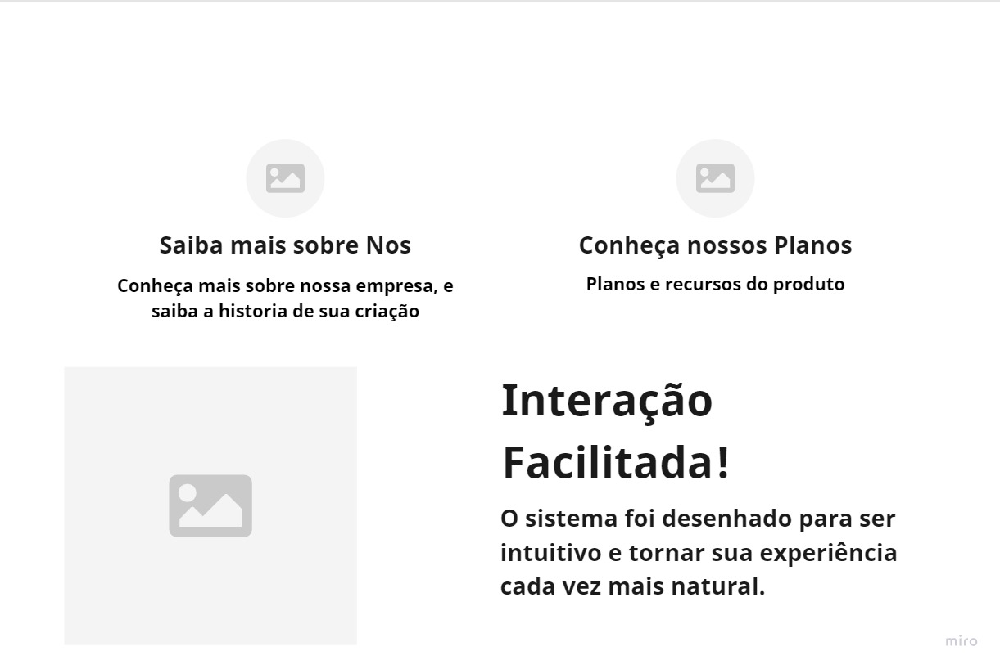
> 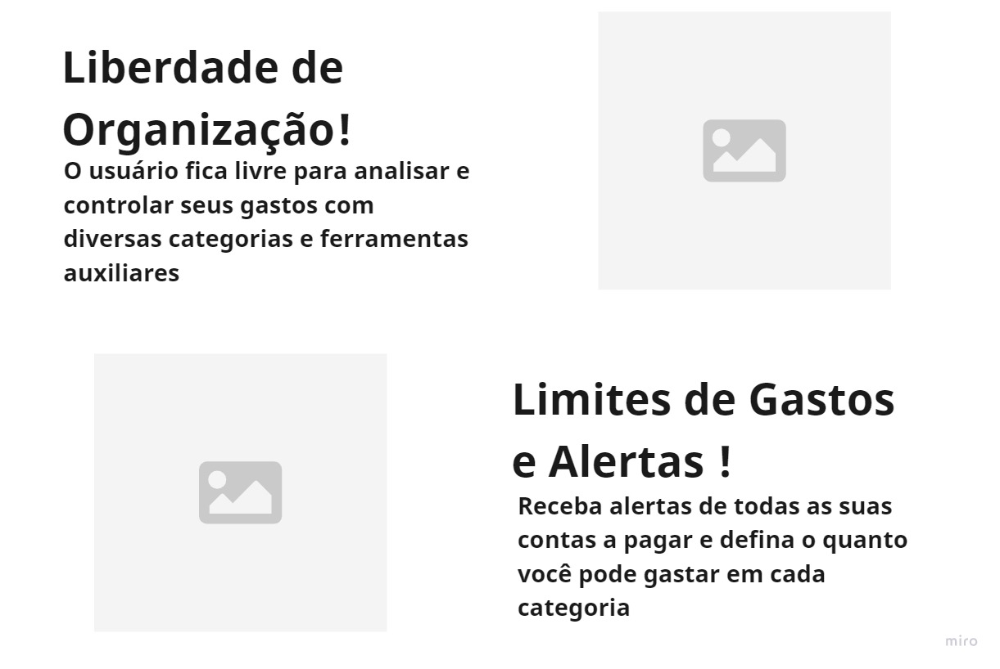
> 
> 

## 3.4 Tela - Quem Somos
A tela de categoria Quem Somos apresenta os:
 
  -Informações sobre a história criativa e de desenvolvimento da nossa plataforma e fala sobre os integrantes do projeto;
  -Componente de INSCREVA-SE permite ao usuário realizar seu cadastro no site;
  -Componentes de HOME e PLANOS E RECURSOS dão acesso às páginas de cada uma das seções disponibilizadas;

> 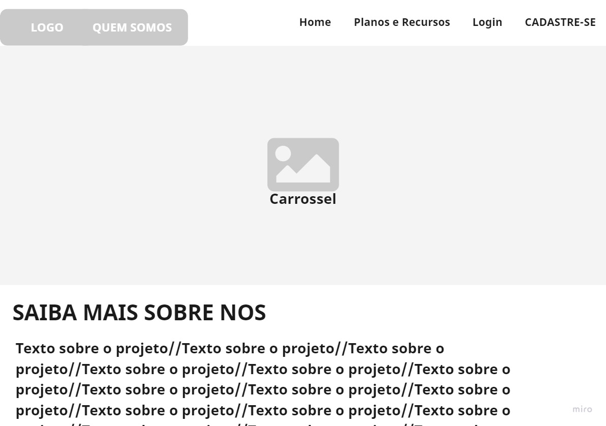
> 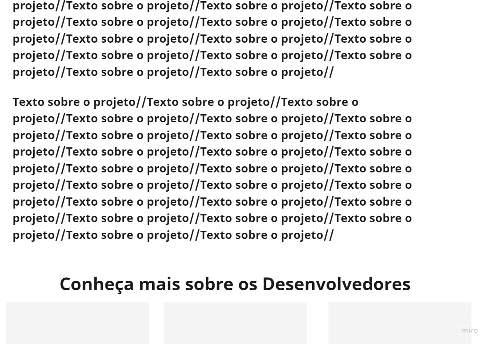
> 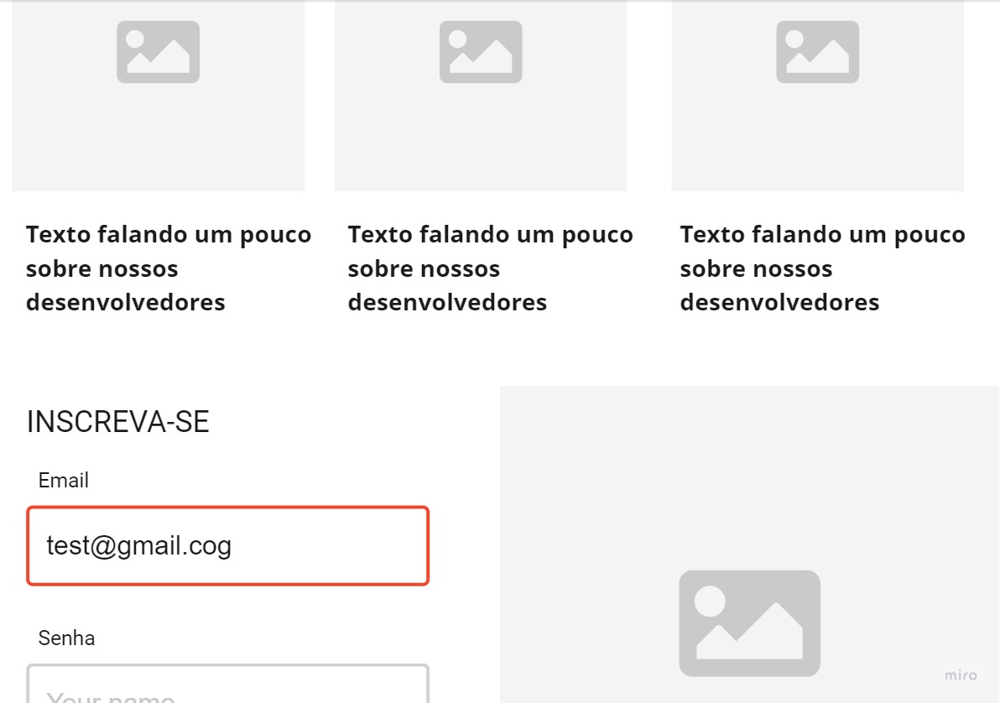
> 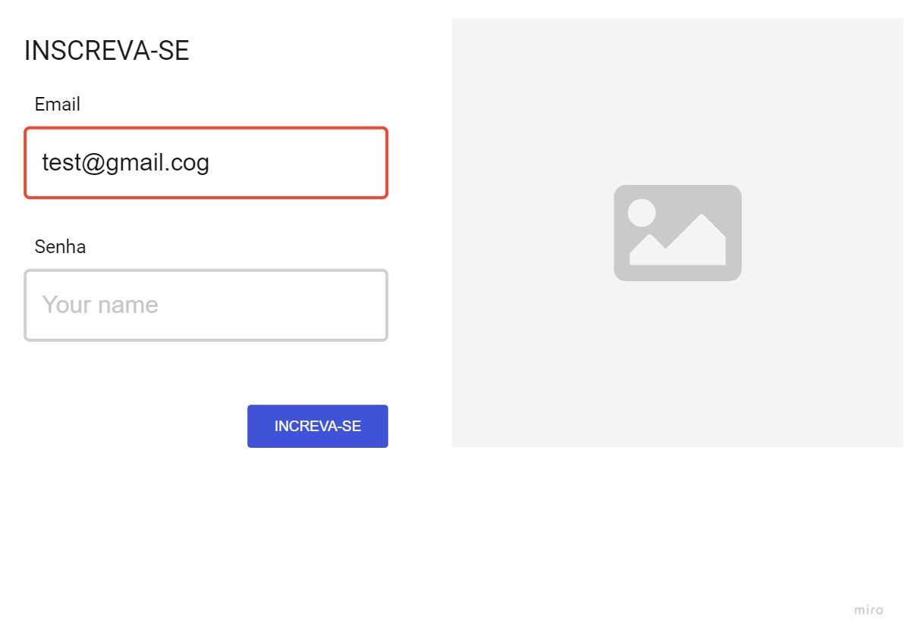

## 3.5 Tela - Planos e Recursos
A tela de categoria Planos e Recursos apresenta os:
  -Planos da nossa plataforma para o usuário e detalha sobre os recursos do nosso projeto;
  -Componente de INSCREVA-SE permite ao usuário realizar seu cadastro no site;
  -Componentes de HOME e PLANOS E RECURSOS dão acesso às páginas de cada uma das seções disponibilizadas;

> 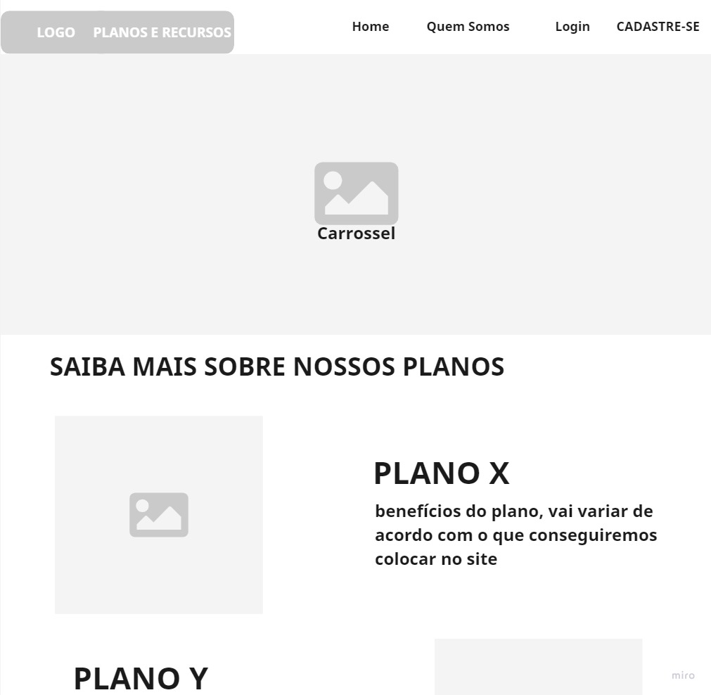
> 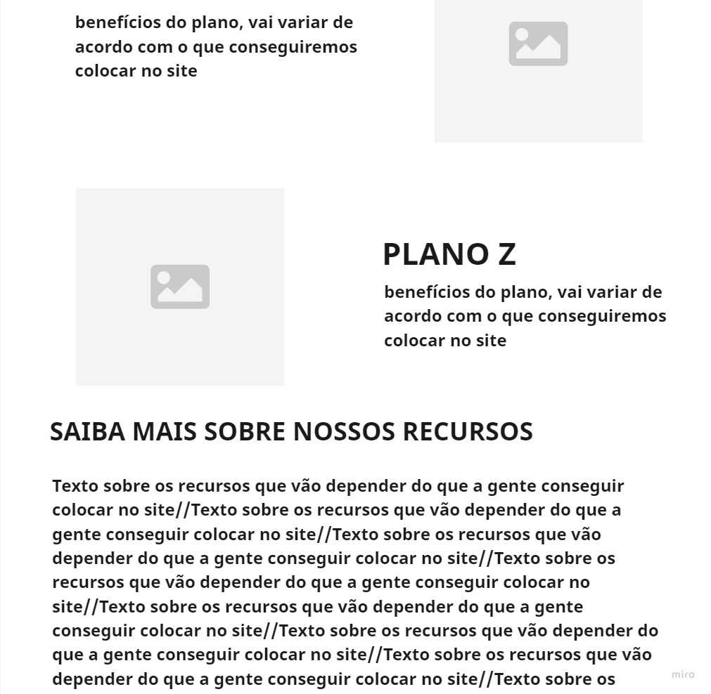
> 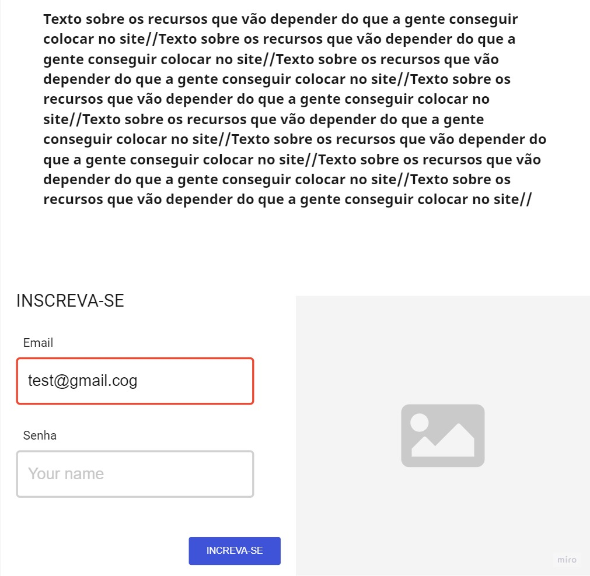

## 3.6 Tela - Fin Assistant
A tela do Fin Assistant apresenta: 
  -Qual sua renda mensal;
  -Quanto de capital você tem investo;
  -Quanto você tem em dívida;
  -Qual seu objetivo financeiro;

#  4 Metodologia

A metodologia contempla as definições de ferramental utilizado pela equipe tanto para a manutenção dos códigos e demais artefatos quanto para a organização do time na execução das tarefas do projeto.

## 4.1 Divisão de Papéis
A equipe utiliza metodologias ágeis, tendo escolhido o Scrum como base para definição do processo de desenvolvimento.

A equipe está organizada da seguinte maneira:

 A equipe está organizada da seguinte maneira:
  -Scrum Master: Guilherme Gomes
   -Product Owner: João Madeira
   -Equipe de Desenvolvimento:João Lucas Curi, Arthur Candian, João Madeira, Guilherme Goms

Para organização e distribuição das tarefas do projeto, a equipe está utilizando  o Miro do primeiro semestre para implementas novas ideias e continuar com o trabalho.

 

## 4.2 Ferramentas

Os artefatos do projeto são desenvolvidos a partir de diversas plataformas e a relação dos ambientes com seu respectivo propósito é apresentada na tabela que se segue. 

| Ambiente  | Plataforma              |Link de Acesso |
|-----------|-------------------------|---------------|
|Processo de Design Thinkgin  | Miro |  https://miro.com/app/board/uXjVMYJ6j_s=| 
|Repositório de código | GitHub | https://github.com/ICEI-PUC-Minas-CC-TI/plmg-cc-2023-2-ti2-g04-finmanager |  
|Projeto de Interfaces e Wireframes | Figma |https://www.figma.com/file/2GwD8FrKzZdb5aU8Z1GXxg/FinManage-Assitant?type=design&mode=design&t=5m9W9U6mHESnJc93-1 | 

# 5 Referências

A  seguir traz a referência utilizada nesse trabalho: 
  -"The Benefits of Creating a Budget", artigo do site Forbes.

## Implementacão da solução 

Nesta seção são apresentados os detalhes técnicos da solução criada pela equipe, tratando da Arquitetura da Solução, as estruturas de dados e as telas já implementadas.

## Arquitetura da solução

Diagrama de Componentes
Os componentes que fazem parte da solução são apresentados na Figura que se segue.

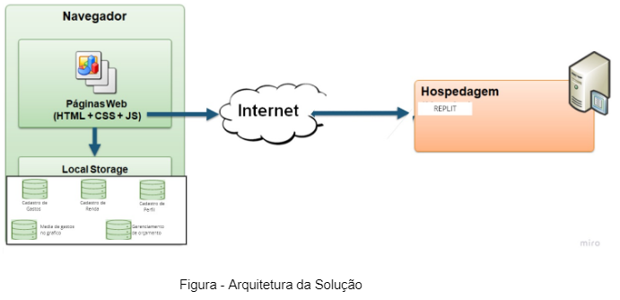
A solução implementada conta com os seguintes módulos:
Navegador - Interface básica do sistema 
Páginas Web - Conjunto de arquivos HTML, CSS, JavaScript e imagens que implementam as funcionalidades do sistema.
Local Storage - armazenamento mantido no Navegador, onde são implementados bancos de dados baseados em JSON. São eles: 
Cadastro de Perfil- seções de cadastro de usuários 
Cadastro de Despesas Fixas- lançamento de gastos do usuário
Cadastro de Renda- lançamento de receita do usuário
Lançamento de Gastos - lista com o cadastro dos últimos lançamentos
Média dos gráficos -utiliza os dados do cadastro para dar médias e mostrar categorias.
Hospedagem - local na Internet onde as páginas são mantidas e acessadas pelo navegador, que em nosso caso foi o replit.

Hospedagem
O site utiliza a plataforma do Replit como ambiente de hospedagem do site do projeto. O site é mantido no ambiente da URL: ***********************localhost *******************
A publicação do site no Replit é feita por meio de uma submissão do projeto (push) via git para o repositório remoto que se encontra no endereço: ******https://github.com/ICEI-PUC-Minas-CC-TI/plmg-cc-2023-2-ti2-g04-finmanager*********************************

Template do Site
O padrão de layout a ser utilizado pelo site tem correspondência ao projeto de Interface elaborado anteriormente.

O template criado é composto pelos seguintes layouts: 
Home page
Quem somos
Login
Interface de utilidade do site.

A responsividade segue o padrão do Bootstrap.

HomePage Comercial
Tela que abrange todas as visualizações iniciais do site e a mostra nossos beneficios..
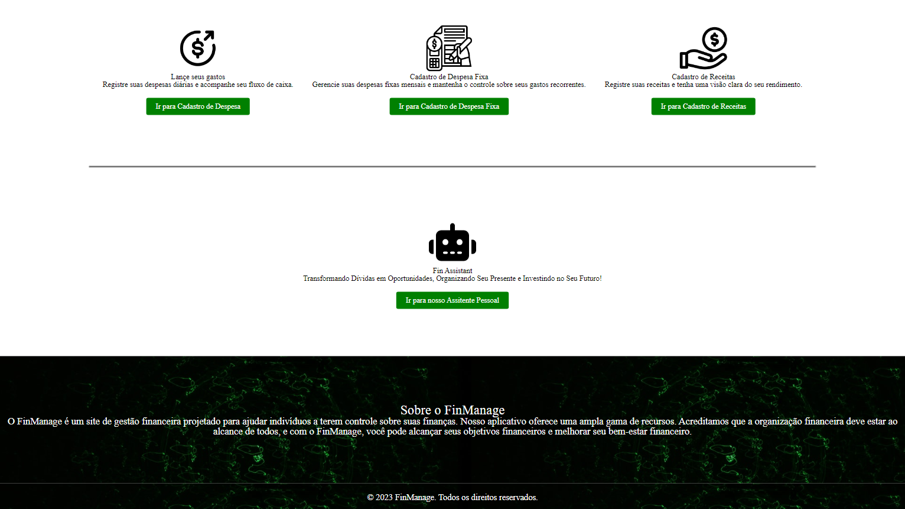

Login/Cadastro
Este layout é utilizado para criação de contas e login no site, o qual dá acesso às funcionalidades.

HomePage da Conta
Local onde são exibidos o nome do usuário, juntamente com caminhos intuitivos para acessar nossas funcionalidades.
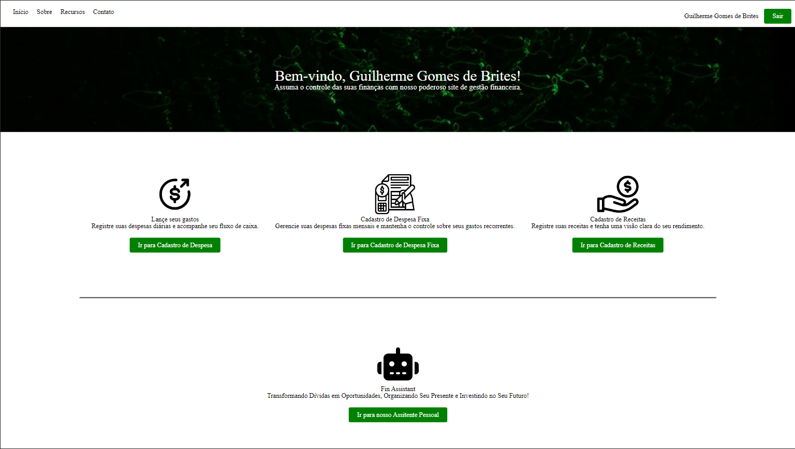

Funcionalidades do Sistema (Telas)
Nesta seção são apresentadas as telas desenvolvidas para cada uma das funcionalidades do sistema. O respectivo endereço (URL) e outras orientações de acesso são apresentadas na sequência.
Entrega Sprint 2 - Cadastro de Despesas Fixas (RF-01, RF-02 e RF-04)

A tela principal dessa funcionalidade apresenta a possibilidade do usuário colocar suas despesas fixas a serem sempre contabilizadas, como por exemplo algum gasto com educação(escola), ou de transporte, podendo também classificar tal gasto em uma categoria. Os dados são armazenados no LocalStorage com estruturas baseadas em JSON. Um exemplo da tela é apresentado na Figura abaixo.. 

Requisitos atendidos
(diversas funcionalidades atendem aos mesmos requisitos, porque elas se complementam)
RF-01 - O site deve permitir que os usuários registrem todas as suas receitas e despesas de forma fácil e organizada.
RF-02 - O site deve permitir que os usuários criem e gerenciem seus orçamentos mensais e anuais.
RF-04 - O site deve permitir que os usuários classifiquem suas transações em categorias, como alimentação, transporte, moradia, entre outras.

Artefatos da funcionalidade:
cadastro-despesa-fixa.html
cadastro-despesa-fixa.js
cadastro-despesa-fixa.css

Estrutura de Dados
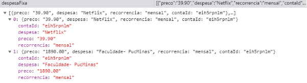
Instruções de acesso
  
  
  
  A tela de cadastro de despesas aparece disponível depois de criar e logar em uma conta, sendo necessário clicar no nome “Cadastro de Despesas Fixas”.

 Cadastro de Receitas (RF-01, RF-02 e RF-04)

A tela principal dessa funcionalidade apresenta a possibilidade do usuário colocar suas receitas, como por exemplo alguma receita advinda do salário, ou alguma pensão. Os dados são armazenados no LocalStorage com estruturas baseadas em JSON. Um exemplo da tela é apresentado na Figura abaixo.
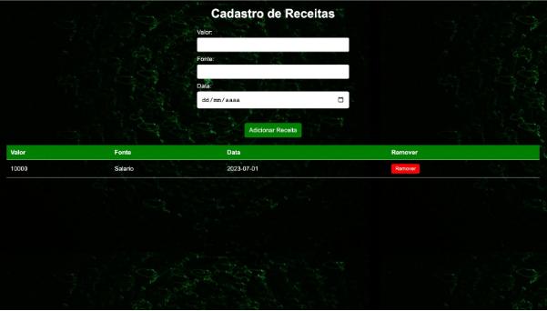
Requisitos atendidos
(diversas funcionalidades atendem aos mesmos requisitos, porque elas se complementam)
  RF-01 - O site deve permitir que os usuários registrem todas as suas receitas e despesas de forma fácil e organizada.
  
  RF-02 - O site deve permitir que os usuários criem e gerenciem seus orçamentos mensais e anuais.
  
  RF-04 - O site deve permitir que os usuários classifiquem suas transações em categorias, como alimentação, transporte, moradia, entre outras.

Artefatos da funcionalidade
  cadastro-receita.html
  cadastro-receita.js
  cadastro-receita.css

Estrutura de Dados
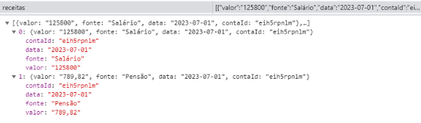
Instruções de acesso
  Abra um navegador de Internet e informe a seguinte URL: https://repl.it/Sf3l@#3ks 
  A tela de cadastro de despesas aparece disponível depois de criar e logar em uma conta, sendo necessário clicar no nome “Cadastro de Receitas”

 Criação de Conta e Login 
Alunos responsáveis: João Madeira Carneiro Braga de Freitas/João Lucas Azeredo Coutinho Curi
A tela principal dessa funcionalidade apresenta a possibilidade do usuário criar sua conta na plataforma e realizar seu login para acessar nossas funcionalidades . Os dados são armazenados no LocalStorage com estruturas baseadas em JSON. Um exemplo da tela é apresentado na Figura abaixo.
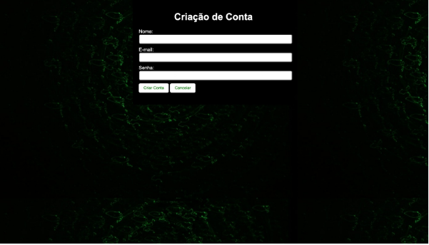
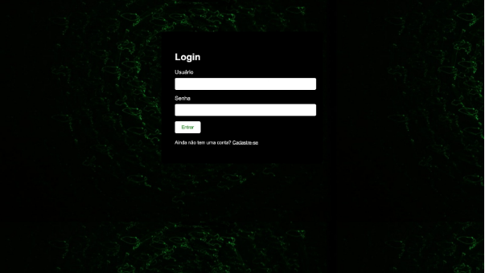

Requisitos atendidos
(diversas funcionalidades atendem aos mesmos requisitos, porque elas se complementam)
  A parte de login não foi um requisito específico, entretanto ela compõe todos os outros requisitos e é de extrema importância e a base do funcionamento do site.

Artefatos da funcionalidade
  criacão-conta.html
  criacão-conta.js
  criacão-conta.css
  login.html
  login.js
  login.css

Estrutura de Dados
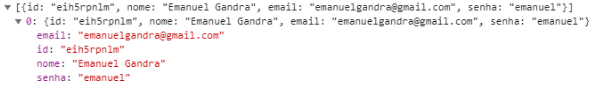
Instruções de acesso
  Abra um navegador de Internet e informe a seguinte URL: https://repl.it/Sf3l@#3ks 
  A tela de criação de conta fica disponível logo em sequência da homepage comercial.

 Cadastro de Gastos, Cadastro de Despesas e implementação da IA

A tela de cadastro de gastos apresenta a possibilidade do usuário colocar suas gastos do dia a dia de forma fácil e organizada, como por exemplo algum gasto com almoço ou uber, podendo também classificar tal gasto em uma categoria. Os dados são armazenados no LocalStorage com estruturas baseadas em JSON. Um exemplo da tela é apresentado na Figura abaixo.

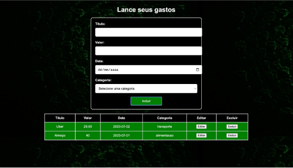

A tela de cadastro de despesas apresenta a possibilidade do usuário colocar suas despesas que você teve em um certo periodo de tempo. Com nome, valor e recorrência.

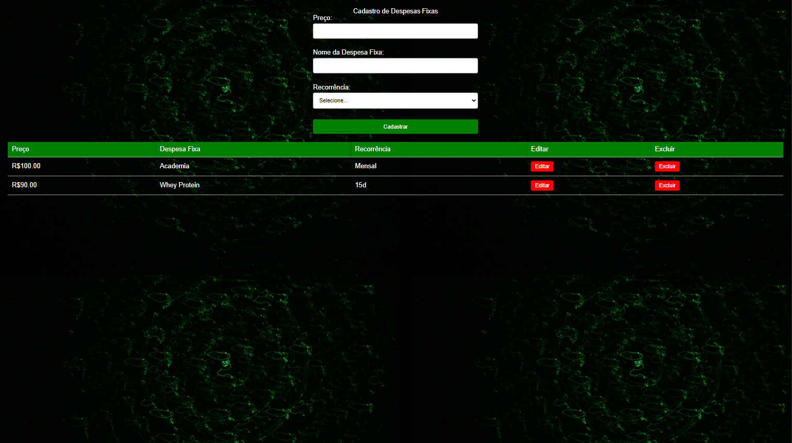

As telas do assistente virtual apresenta  a possibilidade do usuário colocar a renda mensal, o capital que ele investe, se ele possui alguma divida e qual seu objetivo financeiro. Na outra tela o assistente virtual retorna uma reposta em relação aos dados que o usuário preencheu, dando algumas dicas.

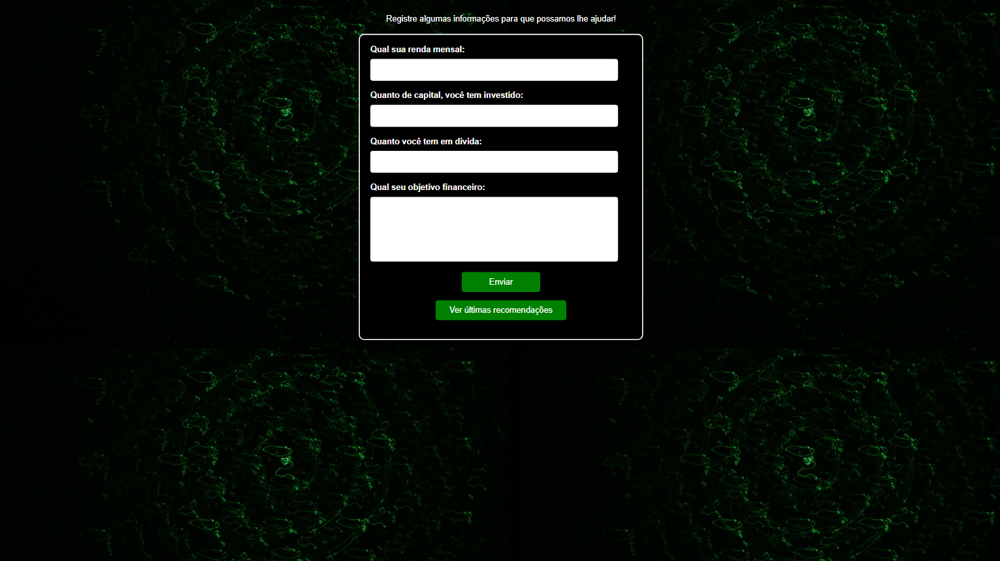
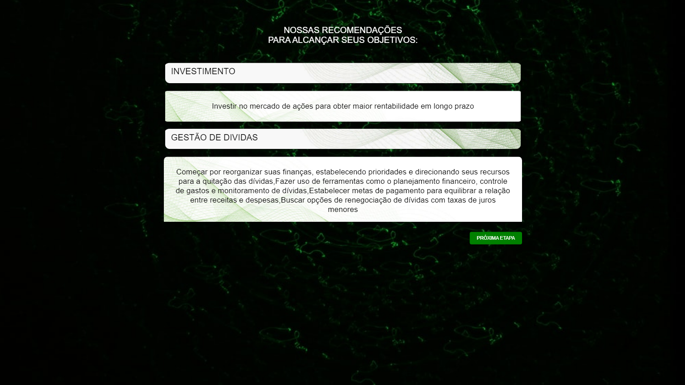

Requisitos atendidos
(diversas funcionalidades atendem aos mesmos requisitos, porque elas se complementam)
  RF-01 - O site deve permitir que os usuários registrem todas as suas receitas e despesas de forma fácil e organizada.
  RF-02 - O site deve permitir que os usuários criem e gerenciem seus orçamentos mensais e anuais.
  RF-04 - O site deve permitir que os usuários classifiquem suas transações em categorias, como alimentação, transporte, moradia, entre outras.

Artefatos da funcionalidade
  cadastro-gasto.html
  cadastro-gasto.js
  cadastro-gasto.css

  cadastro-despesa.html
  cadastro-despesa.js
  cadastro-despesa.css

  assistente-virtual.html
  assistente-virtual.js
  assistente-virtual.css

Estrutura de Dados
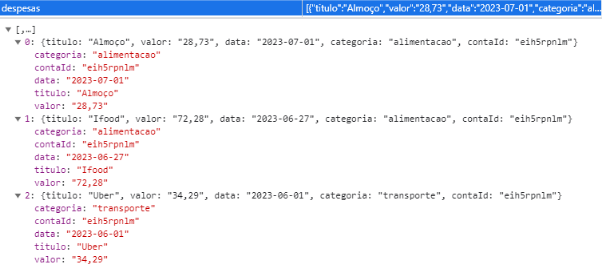

# Avaliação da Aplicação

O processo de realização dos testes da solução desenvolvida está documentado na seção que se segue e traz os planos de testes de software e de usabilidade, na sequência, o registro dos testes realizados.

## Plano de Testes

 Plano de Testes de Software
Requisitos para realização do teste:
Site publicado na Internet
Navegador da Internet - Chrome, Firefox ou Edge
Conectividade de Internet para acesso às plataformas (APIs)

Os testes funcionais a serem realizados no aplicativo são descritos nas imagens a seguir.
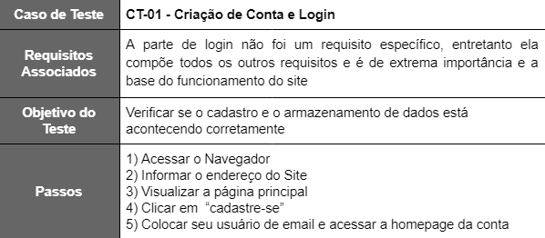
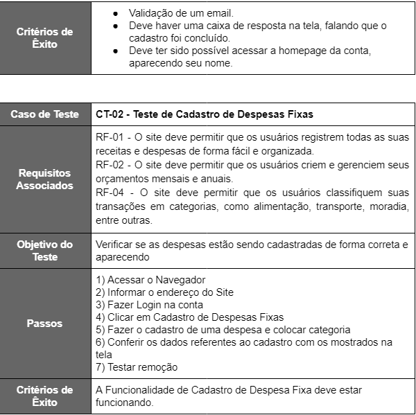

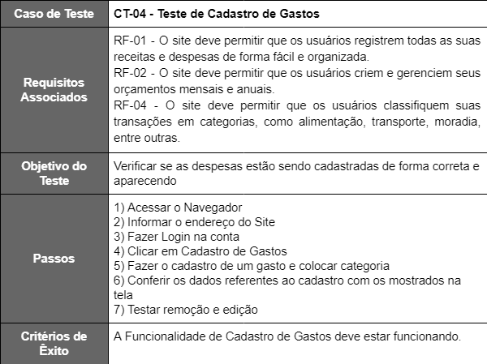

  Registro de Testes de Software
Os resultados obtidos nos testes de software realizados são descritos na Tabela a seguir:
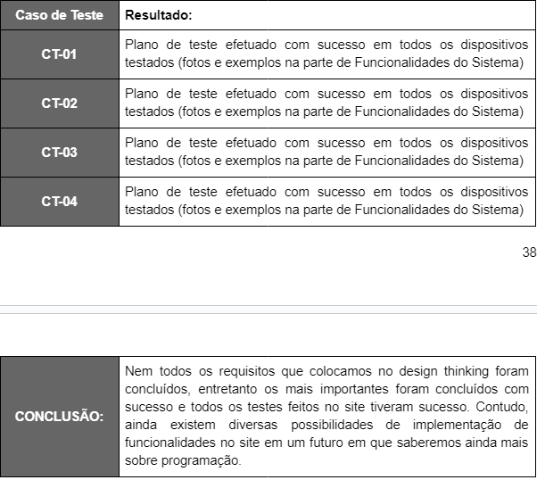

  Plano de Testes de Usabilidade

O planejamento dos testes de usabilidade a serem realizados com usuários são descritos na Tabela a seguir.
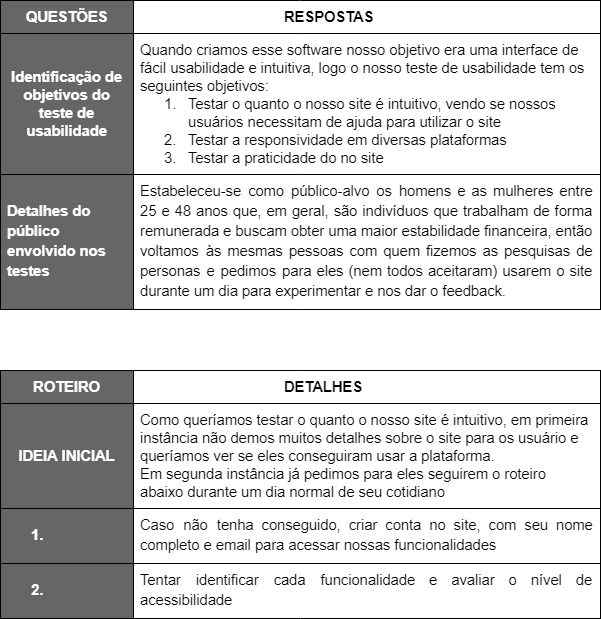
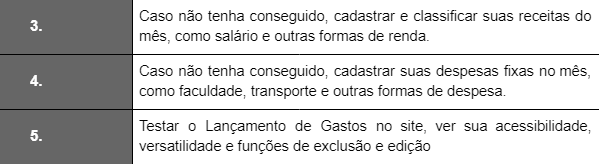

  Registro de Testes de Usabilidade

Os resultados obtidos nos testes de usabilidade realizados são descritos na Tabela a seguir:
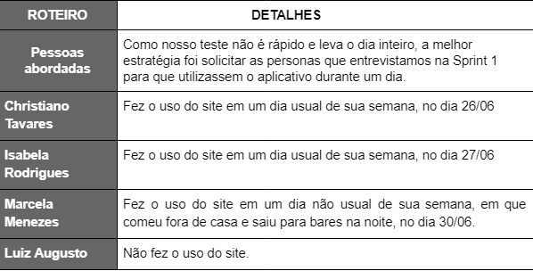

## Registros de Testes

Christiano Tavares:
  Conseguiu usar a plataforma com facilidade e sem auxílio,comprovando a eficiência na praticidade e na acessibilidade.
  Utilizou o site para fazer o gerenciamento de suas despesas e nos mandou print de algumas telas de quando fez o cadastro e de seu uso do aplicativo ao longo do dia:
  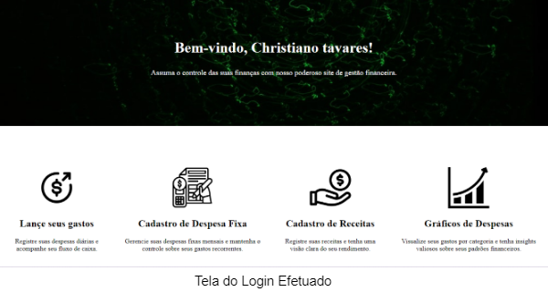
  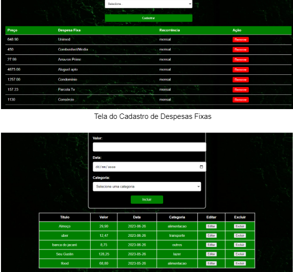
  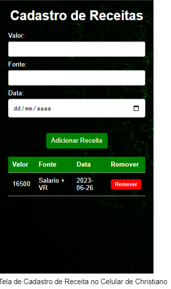

  Christiano foi o que mais se engajou no projeto, conversava com a gente durante o dia no WhatsApp mandando as fotos e atualizações e ao final de sua experiência fizemos uma ligação para conversar e pegar seu feedback. No geral ele gostou muito da ideia do aplicativo e achou uma forma legal de sair do famoso “caderninho“, entretanto apontou que sentiu falta de algumas funcionalidades e deu sugestões que serão apresentadas na conclusão dos feedbacks.

Isabela Rodrigues:
  Conseguiu usar a plataforma com facilidade e sem auxílio,comprovando a eficiência na praticidade e na acessibilidade.
  Utilizou o site para fazer o gerenciamento de seus gastos ao longo do dia e nos mandou print usando em seu notebook durante o trabalho na empresa.

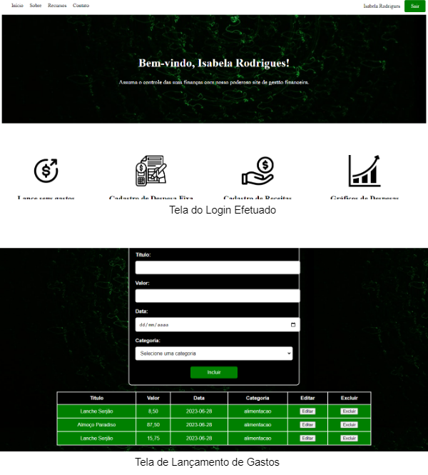

  Isabela usou o nosso site durante a tarde para o lançamento de seus gastos, colocou todos os seus gastos de uma quarta feira usual de seu cotidiano. Ao final da semana no dia 01/07 fizemos uma reunião com ela para pegarmos seu feedback e pra ela passar os prints da conta dela. Ela disse ter gostado bastante da interface e disse que cumpria com o que prometia, porém afirmou  que não seria um aplicativo que ela usaria durante o dia por conta da falta de integração com suas contas bancárias.

Marcela Menezes:
  Conseguiu usar a plataforma com facilidade e sem auxílio,comprovando a eficiência na praticidade e na acessibilidade.

  Utilizou o site para fazer o lançamento de seus gastos ao longo do dia 30/06 e nos mandou print usando em seu notebook e celular durante o trabalho e saindo na sexta.

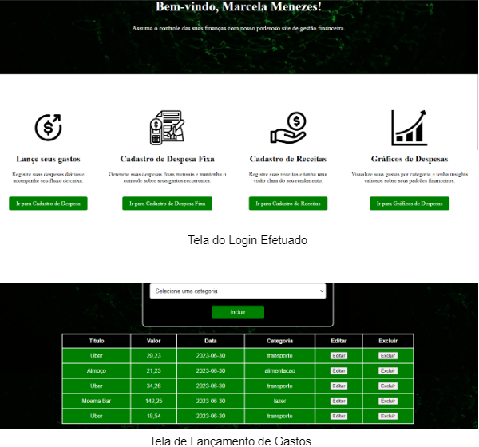
 
  Marcela foi a mais prática e já nos mandou o feedback ao final do dia por áudio falando que gostou bastante da plataforma, que achou o design bonito e chamativo. Ela, que é uma pessoa metódica com os gastos do cartão, achou que era muito melhor e fácil fazer a confirmação dos lançamentos de seu cartão (verificação de lançamentos duplicados e/ou errados)  e achou bem melhor do que usar as planilhas do excel.
  Inclusive usou o site para editar seus gastos que lançou errado quando estava no bar.

Luiz Augusto:
  Entramos em contato com Luiz que nos respondeu afirmando que iria usar o site entre os dias (26-01/07), entretanto ele não usou o site e nem fez o cadastro, o que talvez signifique que ele nao ficou interessado no projeto, apesar de ele ter falado que não usou o site por conta de falta de tempo e da semana corrida no trabalho.

Os problemas e os Feedbacks se encontram na imagem a seguir:
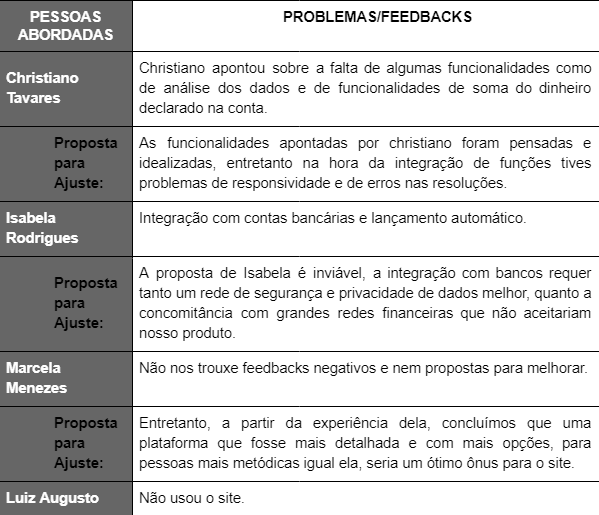

> **Links Úteis**:
> - [Ferramentas de Test para Java Script](https://geekflare.com/javascript-unit-testing/)
> - [UX Tools](https://uxdesign.cc/ux-user-research-and-user-testing-tools-2d339d379dc7)

# Referências

A lista a seguir traz as referências utilizadas nesse trabalho. são elas: 
A a seguir a referência utilizada nesse trabalho. é ela: 
"The Benefits of Creating a Budget", artigo do site Forbes.

